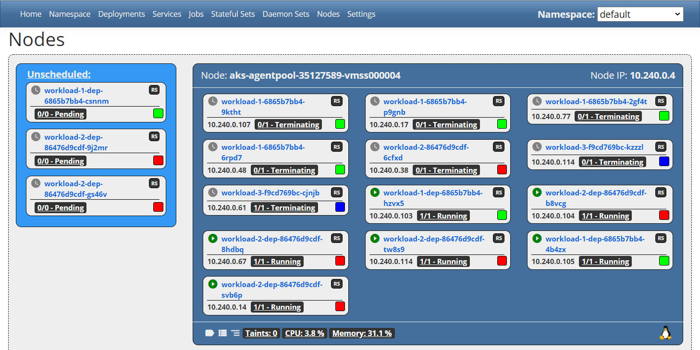

# Kubernetes Cluster Info
In-cluster Kubernetes UI designed for teaching Kubernetes concepts.




# NEVER USE CLUSTER INFO IN A PRODUCTION CLUSTER!!


# Installation:

Add the Helm repo:

```shell
helm repo add scubakiz https://clusterinfosa.blob.core.windows.net/helm
```

Install the Helm chart:

```shell
helm install clusterinfo scubakiz/clusterinfo
```

Wait about 60 seconds for the app to start.  

Forward the service and the app from your local machine at http://localhost:5252:

```
kubectl port-forward svc/clusterinfo 5252:5252 -n clusterinfo
```

# Clean up
To remove Cluster Info from your cluster, uninstall the Helm chart:
```bash
helm uninstall clusterinfo
```

Remove the Helm repo:
```bash
helm repo remove scubakiz
```


#### Technologies Used

This application is written in C# using .Net Core 3.1 with Blazor.

